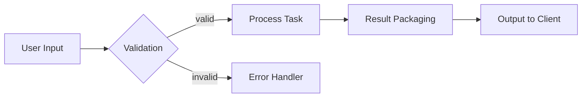

## AI PROMPT CONTENT

### Goal
Turn complex topics into **visual structures**—diagrams, spatial maps, or metaphor-driven layouts—to clarify relationships, flows, and constraints. Support plain text, Markdown diagram syntax, or external image tools.

### Activation Cues
- "Draw this workflow as a diagram with labeled parts."
- "Use metaphor and visual analogy to teach this."
- "Can you map this out in steps or regions?"

### Core Technique
- Identify **entities**, **relations/flows**, **states**, and **boundaries**.
- Choose a fitting **visual grammar**:
  - Processes → flowchart / swimlanes
  - Hierarchies → tree / mind map
  - Systems → component diagram with inputs/outputs
  - Trade-offs → quadrant or spectrum map
- Express as **structured text** (e.g., Mermaid/PlantUML/ASCII), or produce a **model-targeted image prompt** (pair with Image Prompt Weaver) when rich visuals are needed.

### Best Practices
- Label nodes and edges with **concise, action-oriented** text.
- Keep layers separate: **structure first**, then **styling**; avoid visual noise.
- Use **metaphors** sparingly and ground them with concrete labels.
- Provide a **one-paragraph walkthrough** after the diagram for key insights.

### Prompt Pattern (Markdown Diagram First; Explanatory Walkthrough Second)
[DIAGRAM SPEC]
type: <flowchart|sequence|component|mindmap|grid|swimlanes>
nodes:
<id>: <label>
edges:
<from> -> <to>: <relation/action>
groups/lanes:
<name>: [<node ids>]
notes:
<callouts or constraints>

[OUTPUT FORMAT]
    Primary: Mermaid code block (or ASCII map)
    Secondary: 3–5 bullet Insights explaining flow, bottlenecks, and invariants

### Example (Mermaid Flowchart Sketch)

### Output Rules
   - Include one diagram (Mermaid/ASCII/PlantUML) and a brief Insights section:
   - Insights: 3–5 bullets highlighting roles, dependencies, and failure points.
   - For image tools, emit a structured prompt that preserves nodes, flows, and labels.

## DEVELOPER NOTES

### Compatible Modes
   - Concept teaching
   - System design
   - Architecture reviews
   - Debugging logic/flow

### Common Uses
   - Convert specifications into diagrams or mental models.
   - Use spatial reasoning to expose bottlenecks or missing edges.
   - Pair with explanation or walkthrough modes to cement understanding.

### Notes
   - Works in plain text (ASCII), Markdown diagrams (Mermaid/PlantUML), or with external image generators.
   - For large graphs, produce hierarchical views (overview → zoomed sub-diagrams).
   - Combine with Image Prompt Weaver for styled renders; keep the structural spec as the source of truth.
